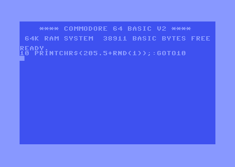
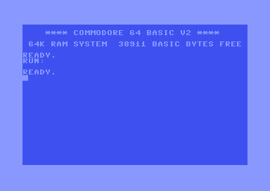

# The original BASIC oneliner

There is a simple one-liner in Commodore 64 BASIC that is so well-known that a
book has been written about it. The program code is so short that it is used as
the title for the book:

[`10 PRINT CHR$(205.5 + RND(1)); : GOTO 10`, A whole book about a single line of
code. By ten authors.](https://bogost.com/books/10_print_chr2055rnd1_goto_10/)

When run, the code starts outputting a pseudo-random maze that goes on forever:



This achieved by outputting, at random, either character 205 or character 206 of
the standard [Commodore 64 character
set](https://www.pagetable.com/c64ref/charset/). It takes up 26 bytes of memory.

# The assembler language equivalent

I saw a [toot on
mastodon](https://mastodon.gamedev.place/@ShaunBebbington/110034823674376940) by
[@ShaunBebbington](https://mastodon.gamedev.place/@ShaunBebbington) with a
version of this effect in Commodore 64 assembler language. After a few toots
back and forth, I managed to shave some bytes off and end up with this minimal
version:

```asm
  loop: lda #205
        lsr $d012
        adc #0
        jsr $ffd2
        bne loop
```

This takes up 12 bytes of memory and runs a bit faster than the original:



How it works:

- `lda #205` loads the accumulator with the value 205 (**L**oa**D**
  **A**ccumulator)
- `lsr $d012` does a **L**ogical **S**hift **R**ight of the `$d012` address.
  This address is used by the graphics chip (VIC) and contains the y-position of
  the rasterbeam that is drawing the screen. By doing a shift right of this
  8-bit value, the rightmost bit 'falls off' and ends up in the special carry
  flag (C), which is a 1-bit flag that is set when calculations overflow. We're
  hoping here that the rightmost bit of `$d012` is enough random-looking, so
  that _C_ now holds a pseudo-random bit
- `adc #0` adds 0 _plus the carry bit (C)_ to the accumulator (**AD**d with
  **C**arry). The accumulator now has value `205` or `206`, depending on the
  value of the carry bit.
- `jsr $ffd2` does a **J**ump to **S**ub**R**outine to the kernal routine called
  `CHROUT` that is hard coded into ROM. It prints out the character corresponding
  to the value loaded in the accumulator.
- `bne loop` jumps back to the beginning. This should really be a `jmp loop`
  because we want to jump back always, unconditionally. But, we use **B**ranch
  when **N**ot **E**qual here because this takes up 2 bytes in memory
  while `jmp loop` takes up 3. Because we know the condition is always true here,
  we can get away with this optimization here.
