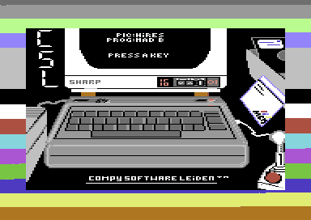
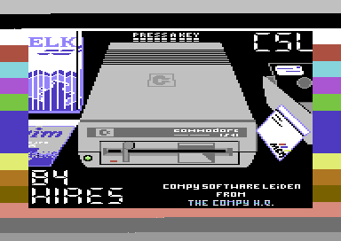
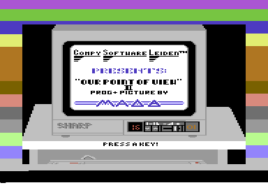
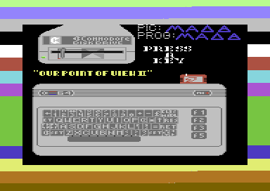
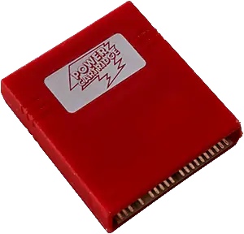
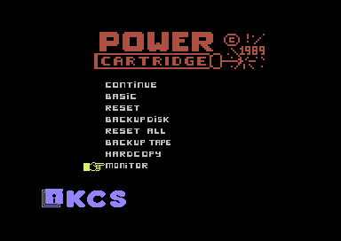

One of my first ventures in demo coding (see
[Demoscene](https://en.wikipedia.org/wiki/Demoscene)) was a very simple picture
collection with background music. The pictures were made by my cousin "Hires",
and by myself, "Mad B". I had just figured out how to display a multicolor
picture, and how to play a soundmonitor tune.

## Our point of view

[Run it in an online emulator](https://lvllvl.com/c64/?gid=4412eef36e137ae8df0b7456f36a21d9)
or
[Download it from CSDB](https://csdb.dk/release/?id=223777)

## Our point of view 2

[Run it in an online emulator](https://lvllvl.com/c64/?gid=b00c94d252e22be92a78bf6a97cff6d1)
or
[Download it from CSDB](https://csdb.dk/release/?id=223780)

## The making of

### Our fascination with the demoscene

Both Hires and me were fascinated with demo's; programs that showed off coding,
drawing and music skills and were pushing the limits of what the Commodore 64
could do. They originated from the intro's that software crackers put in front
of the pirated games that we were playing.

Because of this background, the makers of these demo's hid behind handles (much
like in the graffiti scene), adding a certain mystique to the demoscene. They
organized in groups with names like '1001 crew', 'The Judges' and 'Rawhead',
groups that acknowledged and greeted each other in scrolling text messages, or
were dissing each other because they thought others were 'lamers'.

We got all this information from the demo's on the floppy disks that were
swapped by snail mail with people from all over Europe; there was no internet
and we didn't have a clue who these people were or what they looked like. All we
knew is that they were about our age, cool, talented, and that we wanted to be
like them.

Hires and his friend and neighbour "Herion" had already organized in the group
"Compy Software Leiden", and I joined them soon after as "Mad B".

### The secret language of the machine

I had been programming in BASIC, but it was apparent that this language was too
slow to achieve what we saw in demo's. We needed to get closer to the actual
machine and learn 'machine code'; the instructions that the hardware itself
understands. BASIC was programmer friendly, but machine code reads much more
obscure to the human eye. What's more, unlike BASIC, which was built into the
machine, the Commodore 64 has no built in functionality to help you program in
machine code.

But, the [KCS Power Cartridge](https://retro.ramonddevrede.nl/kcs-power-cartridge/) had!

### The KCS power cartridge

> The KCS Power Cartridge. Press a little white button in the back to enter
> the power menu

This cartridge plugs in to the cartridge port and extends the Commodore 64 with
some powerful tooling. To us, the most important tool was called the 'monitor'.
This was our magical doorway into the world of machine code. With this tool we
could:

- Freeze a running demo
- See the machine code, displayed as more readable mnemonics like `LDA`, `STA`,
  `INX` etc.
- See data bytes like scroll texts displayed as readable characters
- Change machine code and data
- Continue running the demo and see your changes
- Save it to disk

> The KCS Power Cartridge monitor unveiling the secrets of machine language

In the image above, you see the memory location on the left (in the range of
`$0000-$ffff` so about 64k. Hex numbers are expressed with a `$` on the
Commodore 64). Next to that you see the bytes that the CPU understands as
instructions. Each instruction is one byte, optionally followed by one or two
bytes as an argument to the instruction. The third column shows the instruction
as mnemonics (also called assembler code), making it a bit more readable.

So, after studying existing demo's, changing their appearance and scroll texts
to claim that we made them (ahem...), we started making demo's ourselves, using
the monitor tool of the power cartridge. And one of the first things we did is
the humble picture collection "Our Point of View".

## The pain of absolute memory references

While the monitor in the Power Cartridge opened up a world of possibilities by
allowing us to directly write and manipulate the machine code, it has one big
drawback; machine code uses a lot of references to absolute memory locations.
Instructions like:

- `JMP $1003` (continue running code at memory location `$1003`)
- `JSR $9876` (jump to a subroutine at memory location `$9876`)
- `BEQ $0824` (if the result of the last comparison is equality, jump to memory location `$0824`)
- `LDA $4901` (read the value in memory location `$4901` into the accumulator)
- `STA $4901` (write the value in the accumulator in memory location `$4901`)
- `INC $a203` (increment the value at memory location `$a203` by one)

Because the code itself is also just bytes in memory, that means that if you
want to insert or delete an instruction, you need to move your code around in
memory, **messing up any references to that shifted code** and making your jump
instructions jump somewhere else where they are not supposed to jump to.

If you are keeping your data close to your code (because of limited memory), you
might need to move some of that as well to make room for your code, and your
read/write instructions might point to the wrong locations as well.

One of the strategies to lessen this pain was to use a lot of `NOP` instructions
in places where you might need to insert code, or put them over code that you
want to delete. `NOP` stands for "N OPeration" and does nothing. Of course you
end up with a lot of `NOP` instructions that you didn't use after all, wasting 1
byte of memory and 2 execution cycles per `NOP`.

## Next step: assembler

Later on, we got hold of an actual "Assembler"; a text editor/compiler to write
assembler language in. Here you could use labels instead of absolute addresses.
This meant you had to "assemble" the code every time you changed something and
the assembler would put the machine code in memory with the labels translated to
memory locations again. This meant you could easily move your instructions and
data around because they were not tied to specific memory locations anymore. Of
course this came with a cost aswell:

- Having to load the assembler from disk every time you want to code something
- Not being able to use the memory where the assembler lives for your own
  program
- Having to wait for the assembler to assemble your code, which in my memory was
  about 2-5 seconds.

---

The background tunes, made by [Jőrg
Rosenstiel](https://deepsid.chordian.net/?file=/MUSICIANS/R/Rosenstiel_Joerg/Its_a_Sin_remix_2.sid)
and [Chris
Hűlsbeck](https://deepsid.chordian.net/?file=/MUSICIANS/H/Huelsbeck_Chris/Ski_Dance.sid),
were taken from other demo's. It was common practise to steal resources like
character sets and music, and was considered OK as long as the author was credited.
