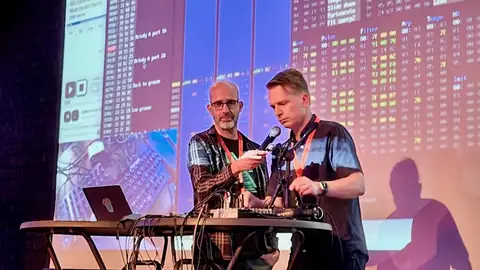
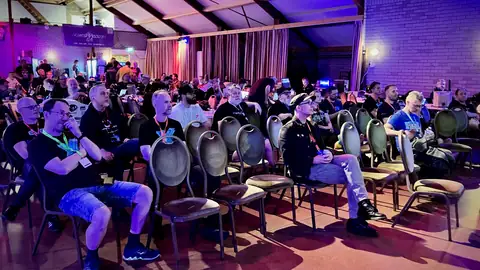
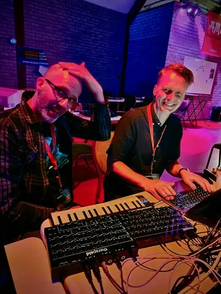
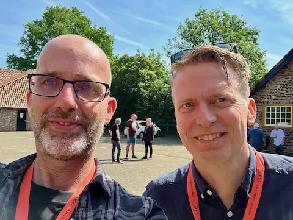
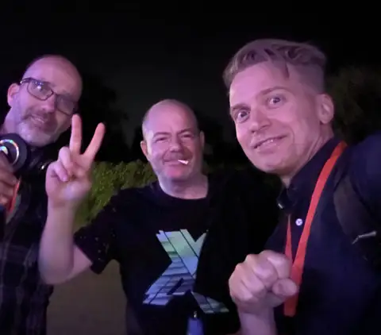

I was at [X2024](https://xparty.net/) this weekend where [Thomas Jansson, a.k.a. Tubesockor](https://www.facebook.com/tubesockor)
and I
did a presentation about Sidfactory 2 and hardware support.

[Sidfactory 2](https://github.com/Chordian/sidfactory2) allows you to compose Commodore 64 music on your modern Windows, macOS or Linux computer. It emulates the SID sound
chip and produces files that run on the real Commodore 64 home computer.

Thanks to the ASID protocol, and Thomas' work on integrating it into SidFactory 2, you can now connect actual hardware synths with
real SID chips inside to SidFactory 2, to have the real hardware experience with the convenience of using your own computer.

In this talk I give a quick introduction about SidFactory 2. After that Thomas will demonstrate what you can do when you integrate
the [TherapSID](https://www.twistedelectrons.com/therapsid), a hardware synth with real SID chips inside.



> Our presentation at X2024 about Sidfactory 2 with hardware support

It was excellent meeting Thomas in real life for the first time, after we met and worked on the ASID integration online.

P.S. Thomas made his SID music debut a day earlier in the music competition with his tune [Debut & Credit](https://www.youtube.com/watch?v=epV3E-SMEnw). My entry in the same competition was [Freakandel](/posts/freakandel)

> On our way to get some sleep after a long day of work and play, we ran into the SID legend [Jeroen Tel](https://soundcloud.com/maniacs-of-noise) and had an interesting conversation about A.I. generated music and stuff.