This weekend I spent at [X2023](https://csdb.dk/event/?id=3187) in Someren,
Holland. X is a bi-annual Commodore 64
[demoscene](https://en.wikipedia.org/wiki/Demoscene) event where creative
enthusiasts gather from all over Europe (and some from further away even!). We
get to meet friends we made online, talk to others who's work we admire, and
have a big shootout in one of the competitions. There are competitions for music
and graphics, but the big banger on saturday night is the demo competition.



> My little entry for the demo competition

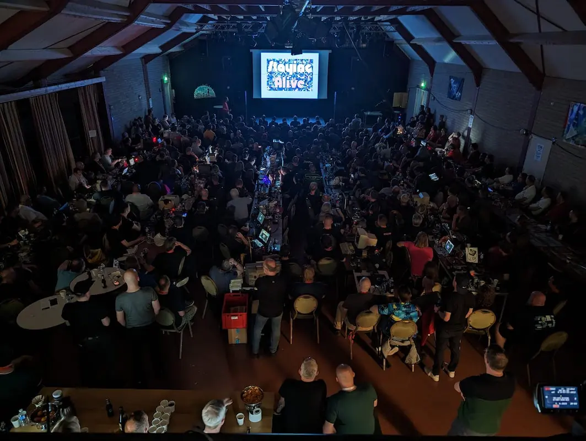

You can download "Staying Alive" at the
[CSDb](https://csdb.dk/release/?id=232978), or just read some of the comments
there.

I even got a mention in the [local digital
newspaper of Someren](https://www.ed.nl/someren/kunst-maken-op-veertig-jaar-oude-commodore-64s-de-jochies-in-600-volwassen-mannen-staan-op-in-someren~a95b90b9/):

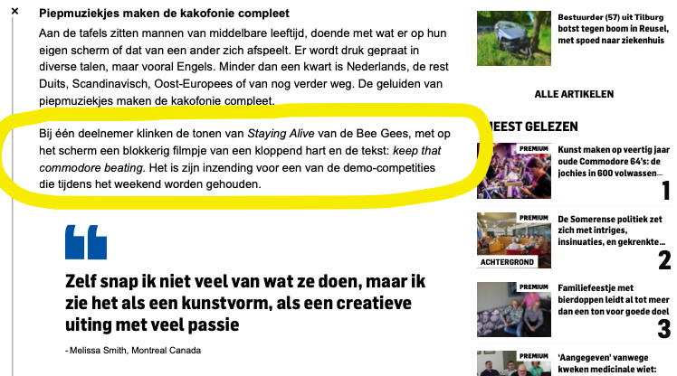

> "One participant plays the tones of Staying Alive by the Bee Gees, with a
> blocky video of a beating heart and the text: keep that commodore beating on
> the screen. It's his entry for one of the demo competitions held over the
> weekend."

## From animated GIF to PETSCII

The demo consist of a few PETSCII animations and a small storyline narrated by
the Commodore 64 typing on the screen. PETSCII is the character set that is
built-in in the ROM, and everything you see on the screen is built with those
256 characters.

For the animations, I developed a semi-automatic workflow so I could download
animated GIFs from the internet, touch them up a bit, and convert them to
PETSCII animations. It looks something like this:

- Edit GIFs if necessary
- Extract frames as images from GIF
- Convert images to Petmate file
- Edit Petmate file
- Convert Petmate file to assembler code

### Editing animated GIF

For preparing the animated GIF's I used ImageMagick. ImageMagick is like a Swiss
army knife for editing images. One of the executables ImageMagick gives you is
`convert`.

I found out that before processing an animated GIF, it helps to first "coalesce"
the GIF. This means converting all the frames to full images, instead of using
delta frames (frames that only contain the differences with the previous frame).
If I didn't do this, processing of an animated GIF would give weird
displacements and stuff.

In this step, I also remove the alpha (transparent) channel. To make the
conversion to PETSCII work well, I need to pick the background color to replace
the alpha channel with. Because I decided to use an orange background for the
whole demo, this is the script I used:

```sh
#!/bin/sh
BGCOLOR="#8e5029"
convert -coalesce "$1" -background $BGCOLOR -alpha remove -alpha off "$1.co.gif"
```

> Coalesce animated GIF and replace transparent background with orange

The next step is extracting the individual frames of the animation to images. It
also resizes the frames to 320x200 pixels. In this process, some pixels might be
added to make the image fit, so there is some magic going on to determine which
color these pixels should have to match the background color,

```sh
#!/bin/sh
DEST=$2
rm -rf "${DEST}"
mkdir -p "${DEST}"

# Assume color of pixel 0,0 in first frame is background color
# The color is used to fill the area when extending the image to 320x200
BGCOLOR=$(convert "$1[0]" -format '%[pixel:p{0,0}]' info:-)
echo Background color: $BGCOLOR

convert \
  -resize 320x200 \
  -gravity center \
  -extent 320x200 \
  -background "$BGCOLOR" \
  "$1" "${DEST}/out%05d.png"
```

> Extract and resize individual animation frames

### Converting images to Petmate

With the frames of the animation extracted as separate images, I made a little
tool to convert images to PETSCII. As an output format I chose
[Petmate](https://nurpax.github.io/petmate/), which is an open source PETSCII
editor. This way I can touch up the animations before converting them to the
final binary format.

I put the conversion tool on Github as
[img2petscii](https://github.com/micheldebree/c64-tools/tree/main/img2petscii)

The Petmate files are then the source files for the animations, generating code
from them at build time. This allowed me to edit the Petmate files to clean them
up a bit, and see the results immediately in the demo.

### Converting Petmate to assembler code

As the final format I wanted to try and generate direct, unrolled code that
draws the frames on the screen. This turned out to be really fast, so I can
achieve 50fps animations with lots and lots of raster time left over.

Unrolling code is an optimization where you take a piece of code that would
normally be a loop, and instead of repeatedly looping while iterating over a
variable `i` for example, you "unroll" the loop and write out all the iterations
directly. This saves cycles by skipping the test-and-branch at every iteration,
and eliminating indexed lookups into tables. For example:

```asm
    ldx #0        ; 2 cycles
loop:
    lda $1000,x   ; 4 cycles
    sta $0400,x   ; 5 cycles
    inx           ; 2 cycles
    bne loop      ; 2 cycles
    rts           ; 3 cycles
```

> Subroutine to copy 256 character stored at $1000 to screen memory,
> taking 2 + 256 \* (4 + 5 + 2 + 2 ) + 3 = 3333 cycles

```asm
    lda #65      ; 2 cycles
    sta $0400    ; 4 cycles
    lda #78
    sta $0401
                ; ... 253 more lda/sta pairs
    lda #47
    sta $04ff
    rts
```

> Same subroutine unlooped and not looking up values,
> taking 256 \* (2 + 4) + 3 = 1539 cycles, making it more than twice as fast

The trade-off for speed is of course space; it is not the most economical format
to store the animation in.

The output is an assembler source code file where every frame in the animation is
a subroutine that puts the character values in screen memory (starting at
`$0400`), and the character color in the color memory (starting at `$d800`).

A table is included in the source code with the start addresses for the frames
(subroutines) to be called from the main code.

A few simple optimizations are done to reduce the size:

- Delta frames: each frame (subroutine) only applies the changes necessary to
  transform the previous frame into the next.
- Load each unique value only once and store it in all the addresses where
  needed, both screen- and color addresses
- For color values, we can re-use any value for which the lowest nibble is the
  color we want. For example any value `$x8` for any x can be used to set the
  color of a cell to color 8
- If we need a value that is one higher or lower then another value, we can just
  increment or decrement the loaded value.

These are illustrated below in a small snippet:

```asm
ldx #$f8   ; load x-register with value $f8
stx $0400  ; store in screen memory
stx $0402
stx $d801  ; store in color memory, effectively color 8
inx        ; make x-register value $f9
stx $0401  ; store in screen memory
stx $d802  ; store in color memory, effectively color 9
```

> Optimized code by only loading each needed value once
> and storing it multiple times, and using inx/dex where possible

- Character code `$f8` is put in multiple screen locations (`$0400` and `$0402`)
- Character code `$f8` is also used to put color 8 in color location `$d801`
- Character code `$f9` is loaded by just incrementing the register

Another optimization could be to increment or decrement a screen or color
address directly if it differs only by one from the previous frame, but I found
this hardly ever occurs, while making the script more complicated.

Depending on how complicated the animations are, this doesn't take much
raster time, and we can easily do 50 frames/second of animation. In practice, the
animations are slowed down because we would have to store too many frames per
animation at this rate, and I thought they look smooth enough.

## X2023 was a blast!

I have been to a couple of X parties, but this was the first time I had
something to show on the big screen, so that was a lot of fun!

I also got to meet some new friends, and catch up with old friends:

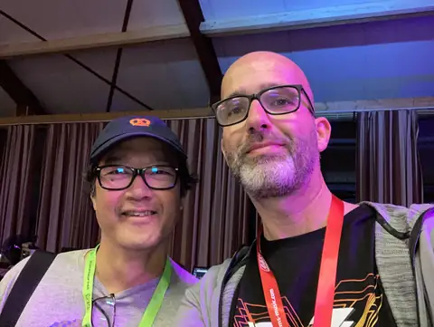

> [SMC](https://csdb.dk/scener/?id=1283), who I worked with on
> [Broware](/posts/broware/). This time, he participated on the soundtrack for
> the amazing demo that came 2nd,
> [Mojo](https://www.youtube.com/watch?v=3aJzSySfCZM).

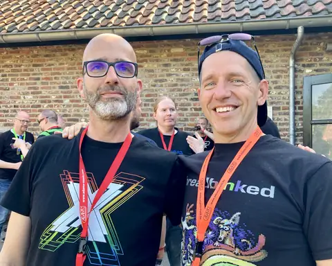

> [Honcho](https://csdb.dk/scener/?id=34209). I did the soundtrack on his
> [Endoskull](https://www.micheldebree.nl/posts/endoskull/) animation. This time
> he was also part of the [Mojo](https://www.youtube.com/watch?v=3aJzSySfCZM)
> production team.

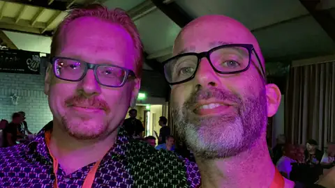

> [Stinsen](https://csdb.dk/scener/?id=23584), who organized the [Last Night
> with Stinsen competition](https://www.micheldebree.nl/posts/the_hangover/)
> before. This time he did a tune for the music competition, [On Borrowed
> Wings](https://www.youtube.com/watch?v=6QfHubgdpyA)

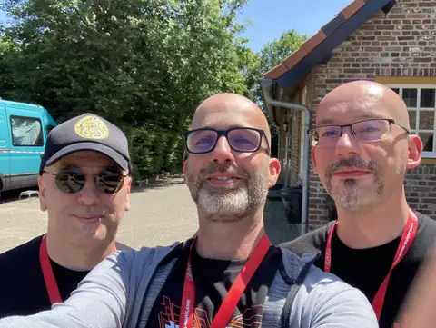

> [Necropolo](https://csdb.dk/scener/?id=20082), who competed with the tune
> [X-istence](https://www.youtube.com/watch?v=gwl6aIClNI8) and
> [Vincenzo](https://csdb.dk/scener/?id=4559), who competed with the tune [Cold
> Fusion](https://www.youtube.com/watch?v=mFJIBYCnDjw) and also did the
> excellent sound design of [Lethargy](https://csdb.dk/group/?id=612)'s [teaser
> trailer for Event Zero](https://www.youtube.com/watch?v=C4us2LVb57g)

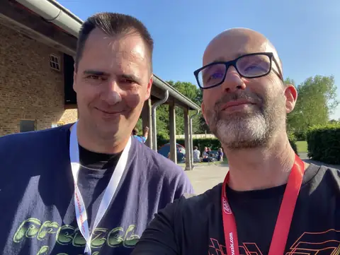

> [The Syndrom](https://csdb.dk/scener/?id=1028), who participated on the
> soundtrack of [Mojo](https://www.youtube.com/watch?v=3aJzSySfCZM), and also in
> the music competition with [Mooj
> Joom](https://www.youtube.com/watch?v=bUSj8bQc8lA)

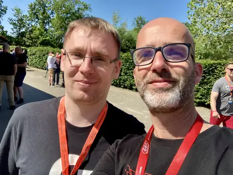

> [Jammer](https://csdb.dk/scener/?id=8105), who came 3rd in the music
> competition with [Sledgejammer](https://www.youtube.com/watch?v=hdhllkNyPgY)

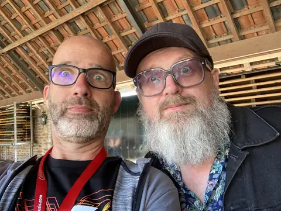

> [Reyn](https://csdb.dk/scener/?id=8051), famous for numerous tunes for games
> and demos (Last Ninja 3, Flimbo's Quest) etc. and for his performance at X. We
> go back a long time so it was good to catch up.

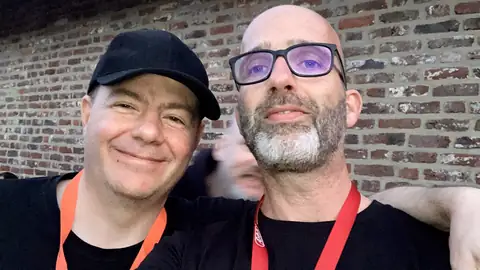

> [Jeroen Tel](https://csdb.dk/scener/?id=8050), the legendary game and demo
> music composer who has been very influential to, I dare say, almost everyone
> doing SID music nowadays. First time we met we both still had hair.

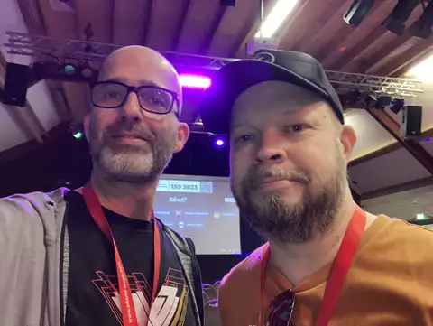

> [Flex](https://csdb.dk/scener/?id=530). I am a fan of his always uplifting
> tunes. This time he did the soundtrack for the fantastic demo
> [Multiverse](https://www.youtube.com/watch?v=6-AF72Vqlwg). He also got to
> interview the legendary Rob Hubbard on stage!


> [Jack-Paw-Judi](https://csdb.dk/scener/?id=35950), who did the complete
> soundtrack for the demo [Hiraeth](https://www.youtube.com/watch?v=Nwh2otqmwmg)
