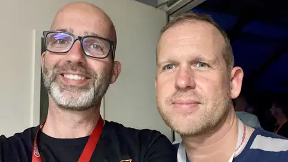

This weekend I spent at [X2023](https://csdb.dk/event/?id=3187) in Someren,
Holland. X is a bi-annual Commodore 64
[demoscene](https://en.wikipedia.org/wiki/Demoscene) event where creative
enthousiasts gather from all over Europe (and some from further away even!). We
get to meet friends we made online, talk to others who's work we admire, and
have a big shootout in one of the competitions. There are competitions for music
and graphics, but the big banger on saturday night is the demo competition. 



> My little entry for the demo competition

You can download "Staying Alive" at the
[CSDb](https://csdb.dk/release/?id=232978), or just read some of the comments
there.

I have been to a couple of X parties, but this was the first time I had
something to show on the big screen, so that was a lot of fun!

I also got to meet some new friends, and catch up with old friends:

> [SMC](https://csdb.dk/scener/?id=1283), who I worked with on
> [Broware](/posts/broware/). This time, he participated on the soundtrack for
> the amazing demo that came 2nd,
> [Mojo](https://www.youtube.com/watch?v=3aJzSySfCZM).

> [Honcho](https://csdb.dk/scener/?id=34209). I did the soundtrack on his
> [Endoskull](https://www.micheldebree.nl/posts/endoskull/) animation. This time
> he was also part of the [Mojo](https://www.youtube.com/watch?v=3aJzSySfCZM)
> production team. 

> [Stinsen](https://csdb.dk/scener/?id=23584), who organized the [Last Night
> with Stinsen competition](https://www.micheldebree.nl/posts/the_hangover/)
> before. This time he did a tune for the music competition, [On Borrowed
> Wings](https://www.youtube.com/watch?v=6QfHubgdpyA)

> [Necropolo](https://csdb.dk/scener/?id=20082), who competed with the tune
> [X-istence](https://www.youtube.com/watch?v=gwl6aIClNI8) and
> [Vincenzo](https://csdb.dk/scener/?id=4559), who competed with the tune [Cold
> Fusion](https://www.youtube.com/watch?v=mFJIBYCnDjw) and also did the
> excellent sound design of [Lethargy](https://csdb.dk/group/?id=612)'s [teaser
> trailer for Event Zero](https://www.youtube.com/watch?v=C4us2LVb57g)

> [The Syndrom](https://csdb.dk/scener/?id=1028), who participated on the
> soundtrack of [Mojo](https://www.youtube.com/watch?v=3aJzSySfCZM), and also in
> the music competition with [Mooj
> Joom](https://www.youtube.com/watch?v=bUSj8bQc8lA)

> [Jammer](https://csdb.dk/scener/?id=8105), who came 3rd in the music
> competition with [Sledgejammer](https://www.youtube.com/watch?v=hdhllkNyPgY)

> [Reyn](https://csdb.dk/scener/?id=8051), famous for numerous tunes for games
> and demos (Last Ninja 3, Flimbo's Quest) etc. and for his performance at X. We
> go back a long time so it was good to catch up.

> [Jeroen Tel](https://csdb.dk/scener/?id=8050), the legendary game and demo
> music composer who has been very influential to, I dare say, almost everyone
> doing SID music nowadays. First time we met we both still had hair.

> [Flex](https://csdb.dk/scener/?id=530). I am a fan of his always uplifting
> tunes. This time he did the soundtrack for the fantastic demo
> [Multiverse](https://www.youtube.com/watch?v=6-AF72Vqlwg). He also got to
> interview the legendary Rob Hubbard on stage!

> [Jack-Paw-Judi](https://csdb.dk/scener/?id=35950), who did the complete
> soundtrack for the demo [Hiraeth](https://www.youtube.com/watch?v=Nwh2otqmwmg)
